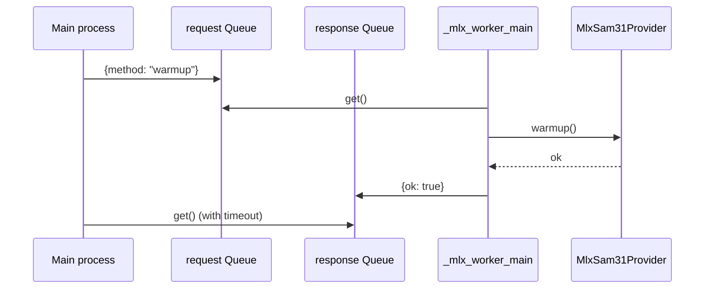

# Inference backends

`meta_watcher.inference.build_provider(models)` picks the object detection backend. The default is SAM 3.1 (per-platform), but `models.provider` can route to a closed-vocabulary `transformers`-backed detector instead:

```python
provider = getattr(models, "provider", "sam3.1")
if provider == "detr-resnet-50":
    return TransformersObjectDetectionProvider(models.detr_model_id)
if provider == "rt-detrv2":
    return TransformersObjectDetectionProvider(models.rt_detr_model_id)
# "sam3.1" falls through to the platform-based routing:
if sys.platform == "darwin" and machine in {"arm64", "aarch64"}:
    return MlxSubprocessSam31Provider(models.mac_sam_model_id)
return CudaSam31Provider(models.linux_sam_model_id)
```

All providers implement the same `InferenceProvider` ABC:

```python
class InferenceProvider(ABC):
    def warmup(self) -> None: ...
    def detect_text_prompts(self, frame, prompts) -> list[Detection]: ...
    def start_tracking(self, frame, prompts) -> list[Detection]: ...
    def track_next(self, frame) -> list[Detection]: ...
    def shutdown(self) -> None: ...
```

`StreamProcessor` calls `detect_text_prompts` for inventory labels and `track_next` once an occupancy event is live. `start_tracking` is called on the first `event_started` frame so providers can reset internal tracking state. `warmup` is invoked once per provider on the consumer thread before the first real frame is pulled.

## Apple Silicon: MLX subprocess provider

`MlxSubprocessSam31Provider` is the default on macOS arm64. It spawns a `multiprocessing` worker (`spawn` context) and marshals method calls over two queues:



### Why a subprocess

`mlx-vlm` imports Metal/MLX modules that are not safe to share with the rest of the Python runtime on some Mac configurations. Isolating them in a dedicated process keeps the main process free of Metal state and lets us restart the provider independently when something goes wrong.

### Serialization

Frames are sent as a dict of the numpy image plus plain scalars via `_serialize_frame`, and detections come back as plain dicts with `label`, `confidence`, `bbox`, `mask` (optional), `track_id`, `metadata` via `_serialize_detections`. Masks and numpy arrays are converted with `np.asarray` to avoid sharing torch/mlx tensors across process boundaries.

### Timeouts and restart

`timeout_seconds` (default 120s) guards every RPC call. If the worker process exits while a call is in flight, the provider raises `RuntimeError("The MLX worker process exited unexpectedly.")`. `shutdown` sends a `shutdown` message and joins the process with a 5-second grace period before terminating.

### In-process MLX provider

`MlxSam31Provider` is the underlying in-process implementation. It loads `mlx-community/sam3.1-bf16` via `mlx_vlm.utils.load_model` + `Sam3Predictor`. Detection uses `predict_multi` when available, falling back to per-prompt `predict` calls. `_synchronize_mlx` flushes the MLX command queue after each call to make timings meaningful. Tests in `tests/test_inference.py` do not exercise this path (it requires MLX); the subprocess wrapper is exercised indirectly through the fake-provider tests in `tests/test_app.py` and `tests/test_pipeline.py`.

## Linux CUDA provider

`CudaSam31Provider` loads `facebook/sam3.1` using `sam3.model_builder.build_sam3_image_model` and wraps it with `sam3.model.sam3_image_processor.Sam3Processor`. The warmup path does several platform-specific things that need to stay in sync with upstream `facebookresearch/sam3`:

1. **Import-guarded error.** If `sam3` is not installed, warmup raises a `RuntimeError` that tells the operator to reinstall with `.[desktop,linux]`. This message is asserted by `tests/test_inference.py::LinuxInferenceInstallTests.test_cuda_provider_reports_linux_extra_when_sam3_is_missing`.
2. **`sam3.perflib` fp32 patch.** Upstream ships a fused `addmm_act` kernel that hard-casts `mat1`, `mat2`, and `bias` to `bfloat16`. When the rest of the graph is kept in `fp32`, the next Linear layer raises `mat1 and mat2 must have the same dtype: float vs bfloat16`. `_patch_sam3_fused_addmm_to_fp32()` replaces `sam3.perflib.fused.addmm_act` *and* the symbol already bound into `sam3.model.vitdet` with an fp32-safe linear + activation. The patch is idempotent.
3. **Single-dtype forward.** After building the model, `CudaSam31Provider.warmup` runs a `_cast` closure through `model._apply`. Floating-point tensors become `torch.float32` on the selected device; complex-valued tensors (rotary embeddings) keep their dtype and just move device. `model.train(False)` switches to inference mode. This is asserted by `tests/test_inference.py::LinuxInferenceInstallTests.test_cuda_provider_forces_float32_on_warmup`.
4. **Autocast inference.** Each call to `detect_text_prompts` runs inside `torch.inference_mode()` + `torch.autocast(device_type=..., enabled=True)`. With the fp32 weights this lets PyTorch pick the most efficient per-op dtype without breaking the fused-op replacement.

### Text prompts and tracking

Both providers return a list of `Detection` per call. `start_tracking` stores the prompt list so `track_next` can re-issue the same text prompts on future frames. The current providers do not exploit any special SAM 3.1 tracking memory — each "track" call is a fresh detection pass constrained to the person prompts. The `TrackManager` in `meta_watcher.core` is what assigns stable IDs across frames.

## Transformers detection (DETR / RT-DETRv2)

`TransformersObjectDetectionProvider` is an alternate backend that runs a HuggingFace `transformers` object detection model — either `facebook/detr-resnet-50` or `jadechoghari/RT-DETRv2` out of the box. Select it by setting `models.provider` to `"detr-resnet-50"` or `"rt-detrv2"` in config; the corresponding `models.detr_model_id` / `models.rt_detr_model_id` string controls the exact HF repo used.

It is lighter than SAM 3.1 and cross-platform: the provider picks CUDA → MPS (darwin) → CPU at warmup time via `torch.cuda.is_available()` and `torch.backends.mps.is_available()`. Install with:

```bash
python3 -m pip install -e ".[desktop,detr]"
```

The extra installs `transformers`, `torch`, `torchvision`, and `timm`. `warmup` lazy-imports `transformers` so the module still imports cleanly on a machine without the extra installed — it only fails at the first detection call with a clear `RuntimeError` pointing at the install command.

### Closed-vocabulary matching

DETR and RT-DETRv2 emit COCO class names (`person`, `chair`, `dining table`, `potted plant`, …) — they do not accept free-form text prompts. The provider runs inference once, post-processes via `AutoImageProcessor.post_process_object_detection(..., threshold=0.05, target_sizes=[(H, W)])`, then filters each result through `_matches_any_prompt(label, prompts)`, which runs `normalize_label` over both sides and then checks equality and bidirectional substring matches. That is what lets `"table"` match `"dining table"` and `"plant"` match `"potted plant"`, and it is what lets the four `PEOPLE_PROMPTS` collapse onto COCO `"person"`.

`Detection.mask` is always `None` for this backend (DETR does not produce masks); the existing overlay and recorder already tolerate mask-less detections. `start_tracking` / `track_next` forward to `detect_text_prompts` — the pipeline's IoU-based `TrackManager` is still what assigns stable track IDs across frames. The pipeline's `inference_interval_ms` rate-limiting and `person_confidence` / `inventory_confidence` gates apply unchanged.

`jadechoghari/RT-DETRv2` ships custom modeling code, so `from_pretrained` is called with `trust_remote_code=True`. A user opts into this backend via config, so we enable it unconditionally to keep the "install and set `provider`" UX working out of the box.

## Helpers

- `_move_inputs_to_model(inputs, model)` — generic utility that casts floating tensors to the model's dtype and moves all tensors to the model's device. Used in tests and potential future providers.
- `_to_numpy`, `_coerce_mask`, `_detections_from_output_dict`, `_detections_from_generic_result` — shape normalizers for the two slightly different SAM 3.1 output conventions (dict vs. object with attributes).

## Related docs

- [Pipeline internals](../internals/pipeline.md) — how rate limiting and frame downscaling interact with `detect_text_prompts` vs `track_next`.
- [Inference internals](../internals/inference.md) — the subprocess RPC protocol and the fp32 patch in more depth.
