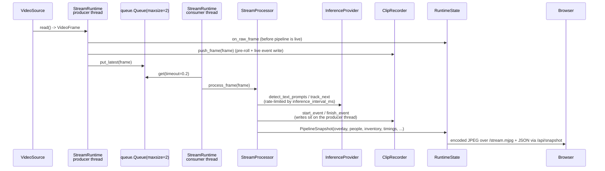

# Architecture overview

Meta Watcher is a local service with three cooperating layers:

1. **Capture and inference pipeline** (`meta_watcher/pipeline.py`, `meta_watcher/core.py`, `meta_watcher/inference.py`, `meta_watcher/sources.py`, `meta_watcher/overlay.py`).
2. **Web runtime state and server** (`meta_watcher/web/state.py`, `meta_watcher/web/server.py`).
3. **Astro operator UI** (`web/src/`) that calls the HTTP API and displays the MJPEG stream.

The whole thing is started from `meta_watcher/app.py` via the `meta-watcher` console script defined in `pyproject.toml`.

## Component diagram

```mermaid
graph LR
    subgraph Browser
      UI[Astro operator UI<br/>(/stream.mjpg + fetch /api/*)]
    end
    subgraph Backend
      CLI[meta_watcher.app.main]
      Server[FastAPI app<br/>meta_watcher.web.server]
      State[RuntimeState<br/>meta_watcher.web.state]
      Runtime[StreamRuntime<br/>meta_watcher.pipeline]
      Processor[StreamProcessor<br/>meta_watcher.pipeline]
      Source[VideoSource<br/>meta_watcher.sources]
      Provider[InferenceProvider<br/>meta_watcher.inference]
      Recorder[ClipRecorder<br/>meta_watcher.core]
      Overlay[render_overlay<br/>meta_watcher.overlay]
    end
    UI -- HTTP --> Server
    Server --> State
    State --> Runtime
    Runtime --> Source
    Runtime --> Processor
    Processor --> Provider
    Processor --> Overlay
    Processor --> Recorder
    Runtime -. on_snapshot .-> State
    State -. MJPEG .-> Server
    CLI --> State
    CLI --> Server
```

## Frame lifecycle



### Two-thread design

`StreamRuntime` spawns:

- **Producer** (`meta-watcher-source`) — calls `VideoSource.read()` at camera rate, pushes each raw frame into `ClipRecorder.push_frame` (so the recording tap sees every frame, not the rate-limited inference output), and drops the frame into a 2-slot queue. When the queue is full it evicts the oldest frame and keeps the newest.
- **Consumer** (`meta-watcher-pipeline`) — pulls the latest queued frame, runs `StreamProcessor.process_frame`, emits a `PipelineSnapshot` to the `on_snapshot` callback. Model warmup happens once here on the first loop.

This split keeps inference latency off the recording and MJPEG paths: if inference is slow, the MJPEG stream and the clip file advance at camera speed; only the annotation lags.

## Request surface

| Consumer        | Path                      | Purpose                                        |
| --------------- | ------------------------- | ---------------------------------------------- |
| Operator UI     | `GET /`                   | Static Astro bundle from `meta_watcher/web/static` |
| Operator UI     | `GET /stream.mjpg`        | Multipart MJPEG video stream                    |
| Operator UI     | `GET /frame.jpg`          | Latest single JPEG (or placeholder)             |
| Operator UI     | `GET /api/snapshot`       | Current pipeline state, inventory, clips        |
| Operator UI     | `GET/PUT /api/config`     | Read/merge the running `AppConfig`              |
| Operator UI     | `GET /api/devices/webcams`| Enumerated webcams (Linux V4L2 / macOS SP)      |
| Operator UI     | `POST /api/runtime/start` | Start the pipeline (optionally with a patch)    |
| Operator UI     | `POST /api/runtime/stop`  | Stop the pipeline                               |
| Operator UI     | `POST /api/runtime/rescan`| Manually rescan inventory                       |
| Operator UI     | `POST /api/runtime/recording` | Toggle clip recording on/off                |

See the [HTTP API reference](../reference/http-api.md) for exact payloads.

## Modules

| Module                     | Responsibility |
| -------------------------- | -------------- |
| `meta_watcher/app.py`      | CLI entry, argparse, uvicorn launch |
| `meta_watcher/config.py`   | `AppConfig` dataclasses, JSON/YAML loading |
| `meta_watcher/sources.py`  | Webcam/RTSP/File sources + webcam enumeration |
| `meta_watcher/inference.py`| MLX (macOS) + CUDA (Linux) SAM 3.1 providers; MLX runs in a spawned subprocess |
| `meta_watcher/core.py`     | `VideoFrame`, `Detection`, `TrackManager`, `StreamStateMachine`, `ClipRecorder`, `render_overlay` helpers |
| `meta_watcher/overlay.py`  | PIL-based overlay renderer with in-frame HUD |
| `meta_watcher/pipeline.py` | `StreamProcessor`, `StreamRuntime`, downscaling + rate-limiting |
| `meta_watcher/web/state.py`| Thread-safe runtime container, MJPEG buffer, config merging |
| `meta_watcher/web/server.py`| FastAPI `build_app` wiring endpoints to `RuntimeState` |
| `meta_watcher/web/static/` | Committed Astro build output (index.html + assets) |

## Where to go next

- [State machine](state-machine.md) for mode transitions.
- [Recording pipeline](recording.md) for pre-roll / post-roll mechanics.
- [Inference backends](inference-backends.md) for the MLX subprocess boundary and the CUDA `sam3.perflib` patch.
- [Pipeline internals](../internals/pipeline.md) for consumer/producer details.
