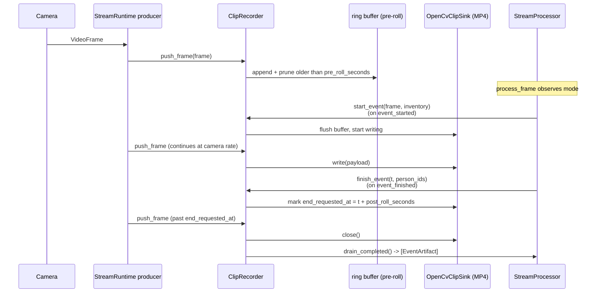

# Recording pipeline

Meta Watcher records one MP4 per occupancy event, plus a JSON sidecar and a JPEG snapshot. Recording is implemented by `meta_watcher.core.ClipRecorder` and wired into the main loop by `StreamProcessor` (decision + overlay side) and `StreamRuntime` (producer side). `output.recording_mode` in the config chooses between three modes: `"raw"` (default — just the camera frames), `"overlay"` (the annotated frames the operator UI shows), or `"both"` (two MP4s per event — raw as the canonical clip, overlay as a sibling `.overlay.mp4`).

## Flow



## Key behaviors

- **Recording mode.** `output.recording_mode` ∈ `{"raw", "overlay", "both"}` selects which channels the recorder maintains. `push_frame` feeds the raw channel (producer thread, camera rate); `push_overlay_frame` feeds the overlay channel (consumer thread, post-`render_overlay`). Each channel has its own pre-roll buffer so pre-event context is preserved on every enabled channel. Either `push_*` call is a no-op when its channel is disabled — the pipeline can call both unconditionally. In `"both"` mode, the raw MP4 keeps the canonical `{source_id}_{stamp}.mp4` filename (same as today) and the overlay is written to a sibling `{source_id}_{stamp}.overlay.mp4`; in `"overlay"` mode, the overlay MP4 is the canonical file.
- **Thread ownership.** `push_frame` is called on the producer thread; `push_overlay_frame`, `start_event`, `finish_event`, `add_person_ids`, and `drain_completed` are called on the consumer thread. The recorder guards all state with a reentrant `threading.RLock`.
- **Pre-roll.** The recorder keeps a deque of recent `_BufferedFrame` entries and prunes anything older than `pre_roll_seconds`. When `start_event` fires, the buffer is flushed into the sink *before* the live event frames start streaming. `config.default.json` sets this at 0.5 seconds; the dataclass default (`TimingConfig.pre_roll_seconds`) is 3.0 seconds.
- **Post-roll.** `finish_event(t, person_ids)` does not close the sink immediately; it sets `end_requested_at = t + post_roll_seconds`. Frames continue to be written until the producer sees a frame timestamp at or past that deadline, which guarantees that the actual camera pacing, not the inference pacing, controls the post-roll length.
- **Clip FPS.** `_estimate_buffer_fps` uses the pre-roll buffer to estimate real fps; if fewer than two frames are buffered it falls back to the frame's reported `fps` or 12.0.
- **Sink factory.** Defaults to `OpenCvClipSink`, which writes `mp4v`-encoded RGB → BGR frames through `cv2.VideoWriter`. Tests use a `MemorySink` for determinism. A custom sink just needs `write(np.ndarray)` and `close()`.
- **Source ID naming.** Clip paths are `{frame.source_id}_{UTC-YYYYMMDDTHHMMSSZ}.mp4`. The sidecar uses the same stem with `.json`.

## Metadata shape

Each event produces a JSON sidecar and an in-memory `EventArtifact`:

```json
{
  "clip_path": "/abs/path/to/recordings/webcam_20260418T003658Z.mp4",
  "snapshot_path": "/abs/path/to/recordings/webcam_20260418T003658Z.jpg",
  "source_id": "webcam",
  "inventory": ["chair", "laptop", "bottle"],
  "started_at": 1712000000.123,
  "ended_at": 1712000012.987,
  "person_ids": ["person-3", "person-4"],
  "raw_clip_path": "/abs/path/to/recordings/webcam_20260418T003658Z.mp4",
  "overlay_clip_path": "/abs/path/to/recordings/webcam_20260418T003658Z.overlay.mp4"
}
```

- `raw_clip_path` / `overlay_clip_path` are populated for whichever channels the active `recording_mode` produced. In `"raw"` mode only `raw_clip_path` is set; in `"overlay"` mode only `overlay_clip_path`; in `"both"` both are set. `clip_path` always points at the canonical MP4 (raw when produced, otherwise overlay).

- `inventory` captures the labels configured at event start (not a snapshot of what SAM 3.1 actually detected).
- `started_at` / `ended_at` are whatever clock the source reports (monotonic for live sources, media position for file sources).
- `person_ids` are the `TrackManager`-assigned track IDs that appeared during the event, drained from `StreamProcessor._event_person_ids`.

## `EventArtifact`

`meta_watcher.core.EventArtifact` exposes `clip_path`, `metadata_path`, `started_at`, `ended_at`, `person_ids`, `snapshot_path`, and `overlay_clip_path` (the last is only set when `recording_mode == "both"`). `StreamProcessor.process_frame` drains these through `ClipRecorder.drain_completed()` and surfaces the clip paths on `PipelineSnapshot.completed_clips`. `RuntimeState` appends them to a persistent list returned by `/api/snapshot` as `completed_clips`.

## Disabling recording at runtime

Set `state.set_recording_enabled(False)` (via `POST /api/runtime/recording` with `{ "enabled": false }`). The producer thread skips `push_frame` when disabled, and `StreamProcessor` stops calling `start_event` / `finish_event`. Existing open events are not forcibly closed; flipping recording off mid-event simply stops new frames being written.
