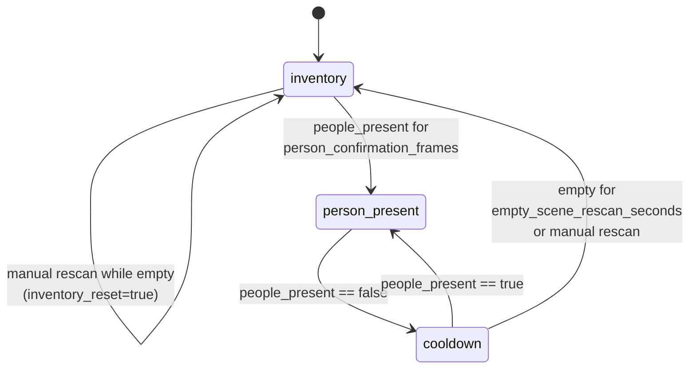

# State machine

The pipeline decides what to render and when to record using `meta_watcher.core.StreamStateMachine`. It has three modes: `inventory`, `person_present`, and `cooldown`. Transitions are driven by per-frame `observe(timestamp, people_present, auto_rescan_enabled=...)` calls from `StreamProcessor.process_frame`.

## Transition diagram

The mode that comes out of `observe` determines:

- which inference calls the processor issues next frame,
- whether the overlay shows the inventory list or the tracked people,
- and whether the recorder should start, write, or finish an event.

## Timings and thresholds

All of these come from the `timings` and `thresholds` blocks in the config (see [configuration reference](../reference/configuration.md)).

- **`person_confirmation_frames`** — number of consecutive "people present" frames required before switching from `inventory` to `person_present`. Filters out flicker detections.
- **`empty_scene_rescan_seconds`** — dwell time after the last person leaves before the machine returns to `inventory` mode and (if `auto_rescan` is enabled) asks the provider to re-validate inventory labels.
- **`person_confidence`** — minimum provider confidence required to count a detection as a person. Applied in `StreamProcessor._normalize_people`.
- **`inventory_confidence`** — minimum provider confidence required for an inventory label to be kept and drawn.
- **`tracking_iou`** and **`min_area_ratio`** — drive `TrackManager` (see below).
- **`overlap_iou`** — merges co-located duplicate person detections before tracking.

## People tracking

`meta_watcher.core.TrackManager` maintains exponentially-smoothed bounding boxes per person:

- A new detection matches an existing track when the labels are equal and IoU ≥ `tracking_iou`.
- Matched tracks update bbox and confidence with `smoothing=0.35` (defined in the class).
- Tracks that go unmatched for more than `max_missed_frames` (default 12) expire.
- Track IDs look like `person-1`, `person-2`, and are stable across matched frames, so they identify the same person through an occupancy event.

Track IDs flow into the recorded event metadata as `person_ids`.

## Manual rescan

The operator panel's **Manual rescan** button (or a `POST /api/runtime/rescan`) calls `StreamStateMachine.request_manual_rescan()`. The request is latched and applied at the next transition point:

- If currently in `inventory` with no people present → immediately triggers an `inventory_reset` so SAM 3.1 re-scans the configured labels.
- If currently in `cooldown` with no people present → ends the cooldown now (even before `empty_scene_rescan_seconds` elapses), returns to `inventory`, and resets.
- If currently in `person_present` → the request is stored and applied once the scene goes empty.

## Auto rescan

`inventory.auto_rescan` controls whether the transition back to `inventory` after an event automatically triggers an `inventory_reset`. When `false`, the pipeline returns to `inventory` mode but does not re-run the configured-label detection pass; the inventory display stays whatever it was before the event started. A manual rescan still forces a refresh.

## Inventory labels

Inventory labels are taken directly from `inventory.labels` in the config. `StreamProcessor._inventory_items_from_labels` normalizes and deduplicates them at construction time and whenever `StreamProcessor.update_labels` is called (used when a config patch changes the label list). Empty label lists short-circuit the inventory detection pass — `FakeProvider.detect_text_prompts` is never asked for an empty prompt list — so inventory mode can legitimately be a no-op.
