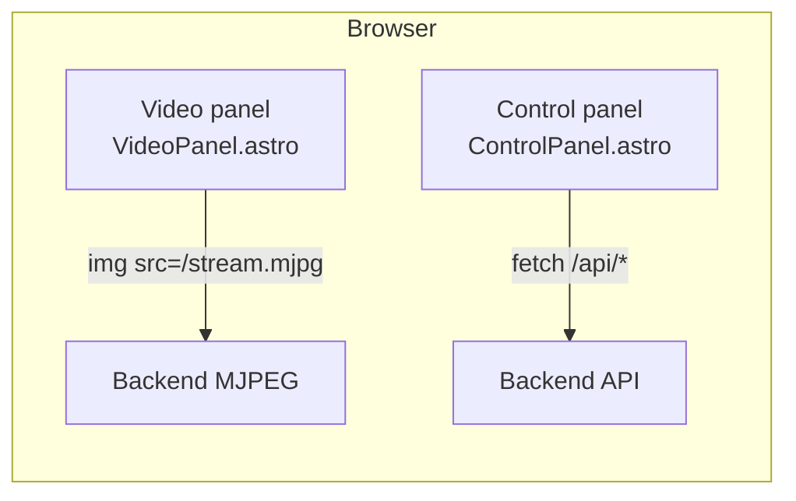
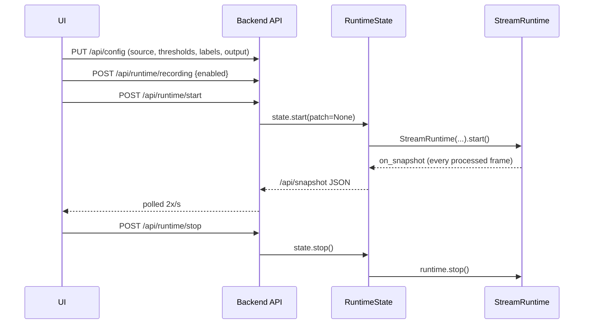

# Operating the web UI

The UI is served at `/` by the Python server and is built from `web/src/` with Astro. The JavaScript glue lives in `web/src/scripts/app.ts` and calls the same HTTP endpoints described in [http-api.md](../reference/http-api.md).

## Layout

- **Video panel (left).** A single `` pointing at `/stream.mjpg`. On Start, the script appends a cache-busting query string so browsers reconnect cleanly after Stop → Start.
- **Control panel (right).** Status readout, form controls for source and thresholds, and a list of completed clips.

## Status readouts

| UI element | Source |
| ---------- | ------ |
| `Mode` pill | `snapshot.mode` from `/api/snapshot` |
| `Status` text | `snapshot.status_text` |
| `Recording` | `snapshot.recording_active` |
| `Frozen scene inventory` | `snapshot.inventory_items[*].label` (with confidence and sample count) |
| `Completed clips` | `snapshot.completed_clips` (newline-joined MP4 paths) |

The panel polls `GET /api/snapshot` every 500 ms (`app.ts::pollLoop`). Errors surface as a red banner at the top of the control panel via `snapshot.error`.

## Controls

| Control | Behavior |
| ------- | -------- |
| Source kind | `source.kind` in the outgoing config patch. When set to `webcam`, the dropdown is populated by `/api/devices/webcams` and the text field is hidden. |
| Source value | For `webcam`, the selected dropdown value (integer index). For `rtsp`, the URL. For `file`, the path. |
| Output directory | `output.directory`; defaults to `recordings` if blank. |
| Person threshold | `thresholds.person_confidence`. |
| Inventory threshold | `thresholds.inventory_confidence`. |
| Inventory labels | `inventory.labels`, split on commas, whitespace-trimmed, empty entries dropped. |
| Auto rescan | `inventory.auto_rescan`. |
| Record clips | Sent separately to `POST /api/runtime/recording` with `{enabled}` before Start. |
| Start | `PUT /api/config` with the collected patch, then `POST /api/runtime/recording`, then `POST /api/runtime/start`. |
| Stop | `POST /api/runtime/stop`. |
| Manual rescan | `POST /api/runtime/rescan`. |
| ↻ next to the webcam dropdown | Calls `loadWebcams(null)` to re-run the enumeration. |

## Start/stop cycle

## MJPEG reconnect

`app.ts::reloadStream` swaps the `` to `/stream.mjpg?t={Date.now()}` whenever the runtime is restarted so the browser does not reuse a broken stream from the previous run. The backend's MJPEG generator handles its own reconnect — it always resumes from the latest available JPEG.

## Production vs. dev UI

The `meta-watcher` CLI serves the committed `meta_watcher/web/static/index.html` bundle. For an interactive dev loop, see the [frontend guide](frontend.md). The dev server (`npm run dev` in `web/`) runs on `:4321` and proxies `/api`, `/stream.mjpg`, and `/frame.jpg` to the Python backend.

## Settings page (`/settings`)

The "Settings →" link in the control-panel header opens a dedicated page that exposes every `AppConfig` field grouped by dataclass section (`source`, `models`, `thresholds`, `timings`, `inventory`, `output`, `upload`). Code lives in `web/src/pages/settings.astro` + `web/src/components/SettingsForm.astro` + `web/src/scripts/settings.ts`.

### Config file selector

- A dropdown at the top lists every `*.json` / `*.yaml` / `*.yml` file under the configured search dirs (the repo root by default). The active file shows `(active)`; read-only files show `· read-only`.
- Click **Load** to switch: the UI calls `POST /api/config/switch` with the selected path. This replaces the in-memory config but **does not restart a running pipeline** — the pipeline keeps running with the previous config until you Stop/Start.

### Save vs Apply

- **Save to file** (primary): `PUT /api/config` with the form patch, then `POST /api/config/save`. The active file is overwritten atomically. If the active file is YAML, a JSON sibling is written instead (to avoid destroying comments/ordering) and that JSON becomes the new active file. A toast reports the final path.
- **Apply in-memory** (secondary): `PUT /api/config` only. The pipeline picks up hot-applyable fields (all of `thresholds`, `models.inference_*`, `inventory.auto_rescan`) immediately; restart-only fields require a Stop/Start.
- **Revert** (tertiary): re-fetches `GET /api/config` and repopulates the form.

### "Requires restart" indicator

Fields that the pipeline captures only at runtime start (`source.*`, `output.*`, `timings.pre_roll_seconds`, `timings.post_roll_seconds`, `upload.*`, model ids, `models.provider`) display a small yellow "restart" pill next to their label. When the runtime is running and at least one dirty field has that pill, a banner at the top of the form reminds the operator to Stop → Save → Start to apply the change.

### Validation

`PUT /api/config` now returns HTTP 400 with `{"error": "..."}` if a known section carries a non-dict value (e.g. `{"thresholds": 42}`). Unknown top-level keys still silently drop for backwards compatibility.

### Timestamps fieldset

Collapsed by default at the bottom of the form. Toggle `enabled` to have the upload worker run `ots stamp` on every uploaded artifact (per-type flags decide which) and push the resulting `.ots` sidecar to the same bucket folder. The uploader logs the sidecar's local and remote paths on stderr so operators can confirm the proof was created — that's the fix for the "I stamped something but didn't see an output filename" gotcha with the raw `ots` CLI (which writes the sidecar silently).
