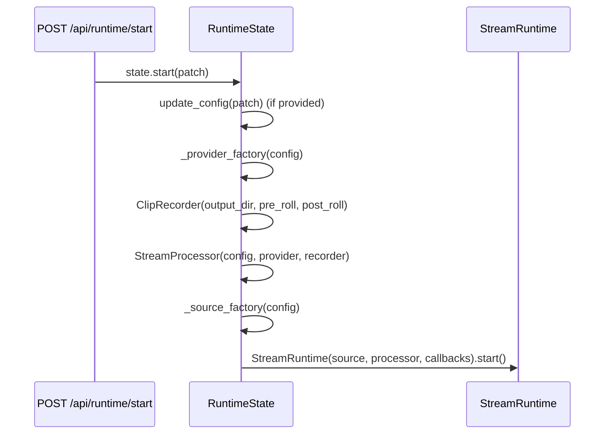

# Web runtime state internals

`meta_watcher.web.state.RuntimeState` is the thread-safe container the HTTP layer talks to. It owns the `StreamRuntime`, the latest JPEG buffer, the cumulative list of completed clips, and the latest snapshot/error. Understanding its locking rules matters when you extend the HTTP surface.

## Threading model

- `_lock: threading.Lock` — guards all mutable fields.
- `_frame_cond: threading.Condition(self._lock)` — used to wait for a new JPEG. Sharing the underlying lock means readers and writers do not need a second acquisition.

Callers fall into four roles:

1. **HTTP handlers (FastAPI)** — call `config`, `config_dict`, `update_config`, `snapshot_payload`, `latest_jpeg`, `wait_for_new_jpeg`, `start`, `stop`, `rescan`, `set_recording_enabled`.
2. **Consumer thread** (via `StreamRuntime.on_snapshot`) — calls `_on_snapshot(snapshot)`. Heavy work: JPEG encoding. Hot critical section: updating the cond-protected frame buffer.
3. **Producer thread** (via `on_raw_frame`) — calls `_on_raw_frame(frame)` while the pipeline is not yet live, so the MJPEG stream has *something* to show during model warmup. Short-circuits once `_pipeline_live` becomes true so annotated frames aren't overwritten.
4. **Error path** (either thread) — calls `_on_error(message)`. Sets `_error`, clears `_runtime`, bumps the JPEG version so the MJPEG waiter wakes up.

## Startup sequence

`start` is a no-op if `_runtime` is already set. The patch is applied *before* the provider/source are built so factory overrides see the freshly merged config. Tests use the `_provider_factory` / `_source_factory` attributes directly to inject fakes.

## MJPEG waiter

`wait_for_new_jpeg(last_version, timeout)` blocks on the condition until `_latest_jpeg_version` changes, with a timeout. The version is incremented in `_on_snapshot`, `_on_raw_frame` (while warmup is live), and `_on_error`. The MJPEG generator handles the timeout case by resending the last available JPEG, which keeps the browser connection alive across idle stretches.

## JPEG encoding

- Done in `_on_snapshot` on the consumer thread so all MJPEG listeners receive a pre-encoded buffer.
- Quality is fixed at `jpeg_quality=80` by default; constructor parameter allows tests to lower it for speed.
- JPEG timings are averaged in a 30-sample deque and logged once per second (`[meta-watcher] jpeg_encode_avg=...ms`).

## Placeholder JPEG

`placeholder_jpeg()` memoizes a 1280×720 "Waiting for camera…" image the first time it's called. It's returned by `/frame.jpg` and by the MJPEG generator whenever the state has no JPEG available.

## Snapshot payload

`snapshot_payload()` walks `_latest_snapshot` plus cumulative fields (`_completed_clips`, `_error`, running flag). The idle-state branch is used before the first real snapshot arrives, which is why the shape includes `frame_index: None` and `source_id: None`.

## Config merging

`update_config(patch)` uses the module-level `_merge_config(base, patch)` helper:

- Converts the base `AppConfig` to a dict via `asdict`.
- Shallow-merges each block, keeping only keys that already exist in the dataclass dict.
- Rebuilds the dataclasses block by block.

This is intentionally conservative: unknown keys never cause a mutation, typed dataclasses stay valid, and a partial patch leaves the rest of the config untouched.

## Error recovery

`_on_error` clears `_runtime`, which means the next `is_running()` call returns `False` even though uvicorn is still serving and the thread has not fully unwound. The operator can call `POST /api/runtime/start` again to retry. The previous error message stays in `_error` until the next snapshot arrives.

If you add a new long-lived background job, route its failures through `_on_error` so the UI's error banner stays consistent.
